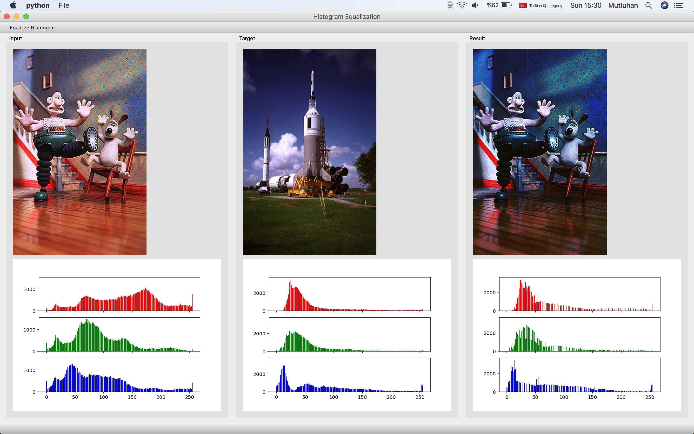

# CV-HW1
Computer Vision - Homework 1 - Start(16.10.2018)

<h1 align="center">
   
  Histogram Equalization
</h1>

This is an image processing application which is developed with 
* PyQt5
* matplotlib
* opencv-python

#### What is this about?

Application waits from user to open two image. One of them is input image and other one is target image. Aim is to make input image's histogram make similar as target image's histogram. Equalize histogram button calls a function and result image printed.

